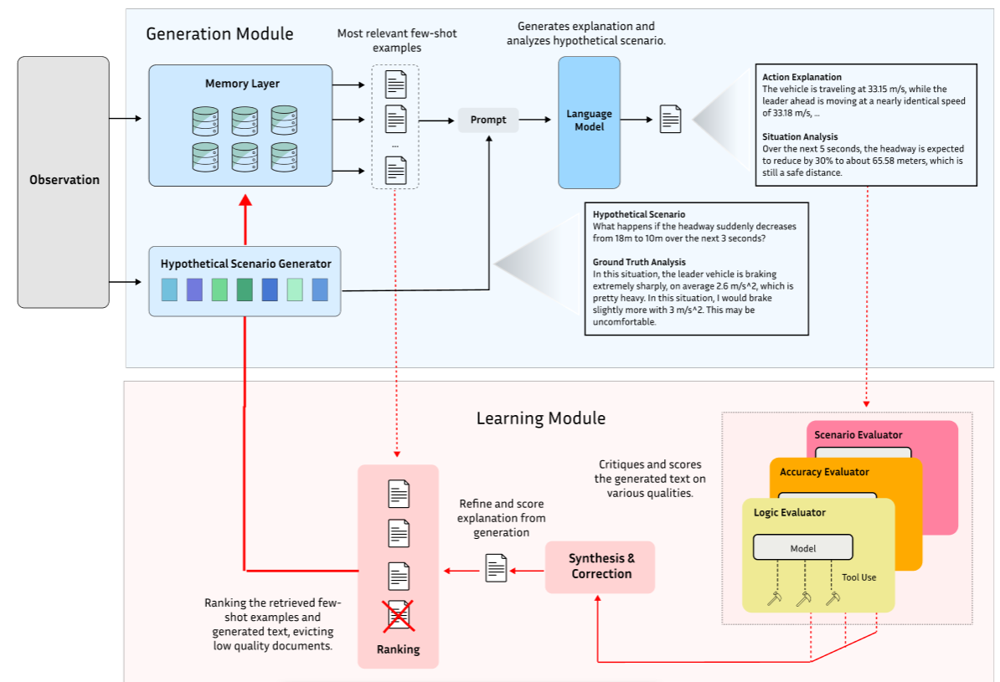

# XAI-Trajectories

# Installation

```
git clone https://github.com/nathanlct/trajectory_training.git
cd trajectory_training
conda env create -f environment.yml
conda activate trajectory
```

# Structure of the code

### `experiments/`
- **`.py`**: These files are config files to set the hyperparameters for experiments.
- **`prompts/`**: Folder that contains different files for prompt engineering and experimentation.

### `models/`
Contains the core models and agents used in the project.
- **`llm_agent.py`**: Defines the necessary classes to enable to use different languages models of your choice (Gemini, Groq, ChatGPT).

### `outputs/`
Contains the results of the user queries.

### `rag_documents/`
Contains the databases of situations that can be retrieved in the generation module.
- **`json/`**: Contains `.json` files if needed in a human-readable format.
- **`pkl_db/`**: Contains `.pkl` files for better storage.

### `utils/`
- **`evaluators/`**: All the content for the evaluation of the output in the training module.
- **`rag/`**: All the content for the retrieval part of the generation module.

### `replay.py`
File to run the entire framework.

# Goal of the project

In this work, we aim to provide a framework to tackle the issue of the black-box functioning of the autonomous vehicle controller. Our key contributions are the following:
- Development of a novel framework that translates complex RL decision-making into interpretable, human-centered explanations
- Validation of the approach using data from large-scale highway experiments with automated vehicles
- Advancement of explainable AI techniques in the critical domain of transportation systems

## Presentation of the framework




## Dataset

Our work is a continuation of the [Vandertest 2021 ICRA work](https://github.com/nathanlct/trajectory-training-icra/). The data of the Mega Vandertest we are using in this work can be found at: https://vanderbilt.app.box.com/s/z3nignz1cgm16dy56r1mqg9ycds40tkz

If you use the trajectory dataset in your published works please cite from this DOI: [](https://doi.org/10.5281/zenodo.6366761)

### Structure of the RAG Database

For each situation, a dictionary is created with the following structure:

```json
[
    {
        "current_situation": {"speed": 71.0, "headway": 35.0, "leader_speed": 70.5},
        "action_explanation": "<observation>First observation<\/observation> <deduction>Second observation<\/deduction> <action>0.5<\/action>",
        "action": 0.5,
        "hypothetical_situation": "What happens if the headway suddenly decreases from 18m to 10m over the next 3 seconds?",
        "situation_analysis": "<observation>First observation<\/observation> <deduction>Second observation<\/deduction> <prediction>The vehicle will brake in 2 seconds.<\/prediction>",
        "embedding_model": "OpenAIEmbeddingModel()"
    }
]
```


# get an explanation

## Write the situation in .py file in ./experiment/

## Run a the file replay.py

## Visualize the results


# Train a controller

```
python train.py --expname test --s3 --iters 200 --algorithm PPO --lr 3e-4 --n_epochs 10 --env_platoon 'av human*5'
```

Run `python train.py - h` for a description of all available args.

Note that a grid search can be ran over most args by specifying several values, for instance `--lr 1e-4 5e-4 1e-5 --gamma 0.9 0.99` will run a total of 3 x 2 = 6 grid searches.

# Evaluate a controller

RL controller trained using `train.py`:

```
python simulate.py --cp_path checkpoints/.../n.zip --av_controller rl --gen_emissions --gen_metrics --platoon scenario1
```

Baseline controller, eg. IDM or FS:

```
python simulate.py --av_controller idm|fs --gen_emissions --gen_metrics --platoon scenario1
```

Run `python simulate.py - h` for a description of all available args.

To send a controller through the leaderboard pipeline, use `--data_pipeline {your_name} {strategy / controller_name} 0`.
Change 0 to 1 in case your run should be marked as the baseline on the leaderboard.

**Steps to evaluate your custom controller**

Define a vehicle class in `env/vehicles.py` (following the same format as `IDMVehicle` or `FSVehicle` for instance). Once created, go in `env/simulation.py`, import your vehicle class at the top of the file, then go to the `add_vehicle` method and add a mapping from your controller name to the vehicle class in the `vehicle_class` dict. Finally, you should be able to run `python simulate.py --av_controller {your_controller_name}`.

# Visualize results

Running `python simulate.py` with the `--gen_emissions` flag will generate a `.csv` emission file from which you can extract metrics that are interesting to you. Some available scripts are:

-   `python visualize/time_space_diagram.py {path_to_emissions.csv}` to generate a time - space diagram
-   `python visualize/platoon_mpg.py {path_to_emissions.csv}` to generate a platoon MPG graph(valid if you ran `simulate.py` with the `--platoon scenario1` flag)
-   `python visualize/render.py {path_to_emissions.csv}` to render your controller in a Pygame window(not functional right now)

Additionally, a good number of plots and metrics are generated when running `simulate.py` with the `--gen_metrics` flag.

Note that the behavior of one controller may largely differ from trajectory to trajectory. `simulate.py` defaults to using a custom `--seed {integer}` so that the same trajectory is used across several runs, and when uploading to the leaderboard. Change the seed to run on a different trajectory, or use the `--all_trajectories` flag to run over all available trajectories. If using that flag, you can check out `visualize/plots_from_emissions.py` to plot some data across all trajectories, possibly comparing two controllers.
